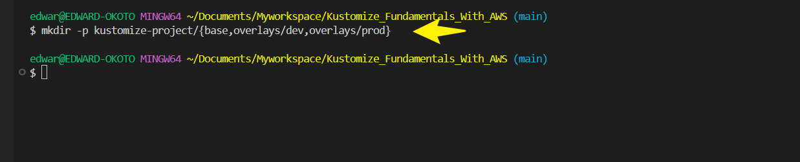
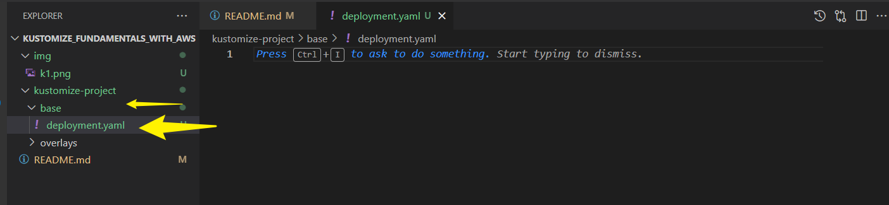
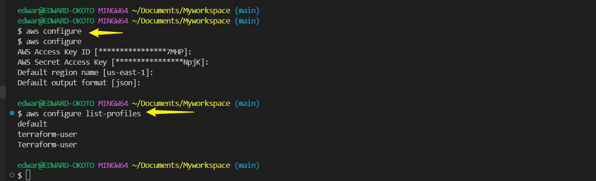
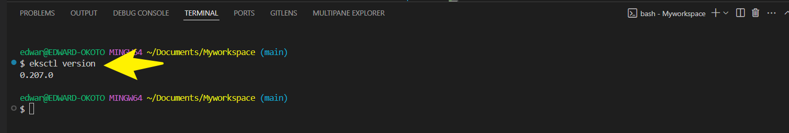
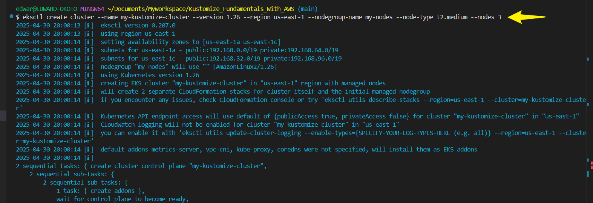
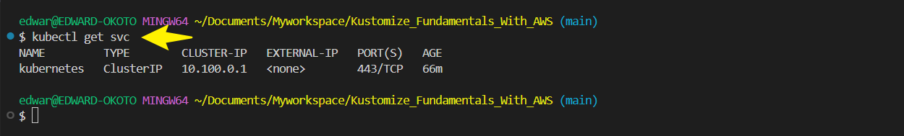
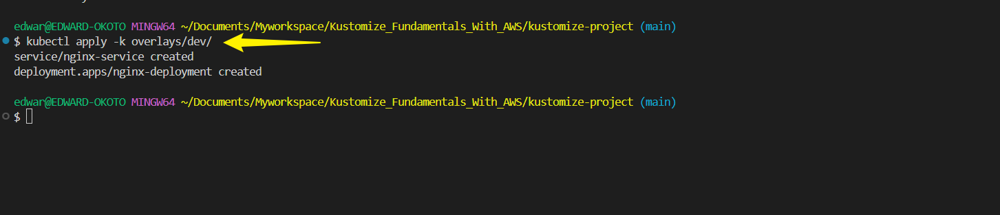
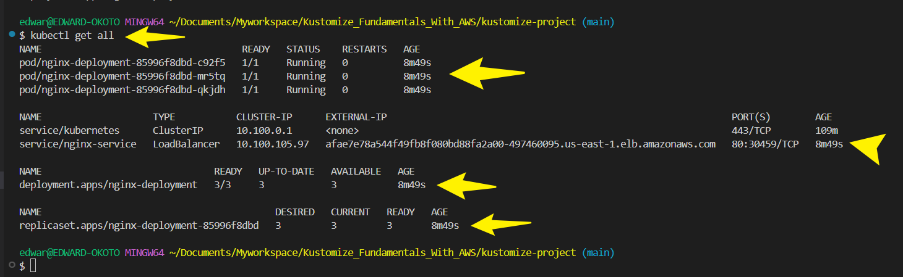
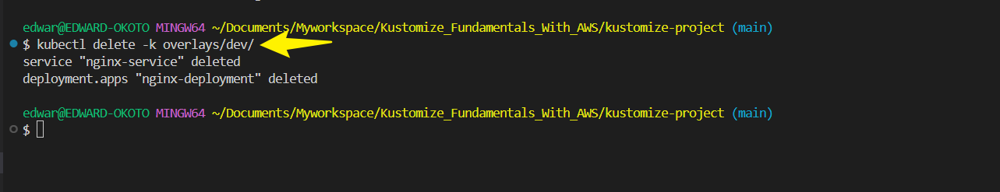
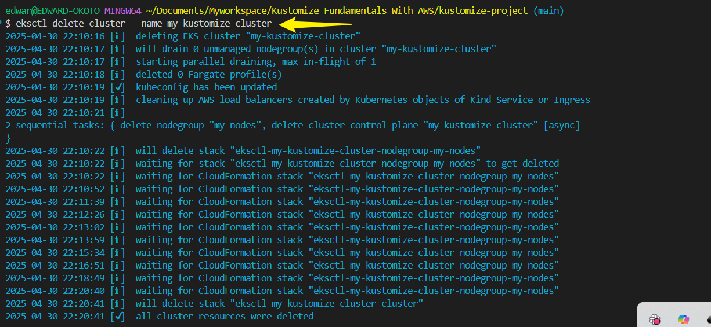

# Kustomize Fundamentals With AWS
### Introduction to Configuration Management in Kubernetes With Kustomize on AWS 


Kustomize follows a **structured approach** to customizing Kubernetes configurations without modifying the base YAML files. Here’s a breakdown of its **directory structure, files, and key concepts**.

---

#### ✅ **Kustomize Directory Structure and Concepts**
Kustomize works with a **base directory** containing standard Kubernetes manifests and **overlay directories** for environment-specific modifications.

Example:
```
kustomize-project/
 ├── base/                          # Common base configuration (unchanged)
 │   ├── deployment.yaml
 │   ├── service.yaml
 │   ├── kustomization.yaml
 ├── overlays/                      # Custom changes for different environments
 │   ├── dev/
 │   │   ├── kustomization.yaml
 │   │   ├── patch-deployment.yaml
 │   ├── prod/
 │   │   ├── kustomization.yaml
 │   │   ├── patch-deployment.yaml
```
✔ The `base` directory contains **standard Kubernetes manifests** (Deployments, Services, etc.).  
✔ The `overlays` directory **modifies base resources** for different environments like **dev, staging, or production**.  
✔  `Kustomization File` **kustomization.yaml** used to declare resources, bases and overlays. 

---

#### ✅ **Key Files in Kustomize**
####  `kustomization.yaml`
The **core file** that defines how Kustomize should modify Kubernetes resources.

Example:
```yaml
namespace: my-app
resources:
  - deployment.yaml
  - service.yaml

patchesStrategicMerge:
  - patch-deployment.yaml

commonLabels:
  app: my-webapp
```
✔ **`resources:`** Lists the base Kubernetes YAML files to use.  
✔ **`patchesStrategicMerge:`** Defines patches that modify deployments.  
✔ **`commonLabels:`** Applies labels across all objects.  

---

#### 📌 Patch Files (`patch-deployment.yaml`)
Used to **override** specific sections of a Kubernetes manifest.

Example:
```yaml
apiVersion: apps/v1
kind: Deployment
metadata:
  name: my-app
spec:
  replicas: 3
```
✔ Changes the **replica count** of a Deployment.

---

##### ✅ **Key Concepts in Kustomize**
1️⃣ **Base & Overlays**  
   - Keeps a **base configuration untouched** while applying environment-specific changes using overlays.
2️⃣ **Patching Resources**  
   - Allows **strategic merges** and JSON patches to modify Kubernetes objects dynamically.
3️⃣ **Variable Substitution**  
   - Customizes fields **without modifying original YAML files**.
4️⃣ **Declarative & GitOps Friendly**  
   - Works seamlessly with **GitOps workflows** to maintain version-controlled configurations.

---


### ✅ **Creating and Managing Resources**

#### **Step 1: Set Up the Directory Structure**
Kustomize uses a **base + overlays** structure for configuration management:

```sh
mkdir -p kustomize-project/{base,overlays/dev,overlays/prod}
```

✔ Creates directories for the base configuration and environment-specific overlays.

---

#### **Step 2: Define the Base Kubernetes Manifest**
Inside `kustomize-project/base/`, create a **Deployment** file (`deployment.yaml`):



```yaml
   apiVersion: apps/v1    # API version for the deployment object
   kind: Deployment       # Specifies that this is a Deployment
   metadata:
      name: nginx-deployment  # Name of the deployment
   spec:                   # Specification of the deployment
      replicas: 2           # Number of replicas (pods running)
      selector:             # Selector to identify the pods
        matchLabels:
           app: nginx
      template:             # Template for the pod creation
        metadata:
        labels:
           app: nginx     # Label applied to the pod
        spec:
        containers:      
        - name: nginx    # Name of the container
           image: nginx:1.14.2  # Docker image to use for the container
           ports:
           - containerPort: 80  # Port the container will expose
```
---


#### **Step 3: Create a Service file**
Inside `kustomize-project/base/`, create a **Service** file (`service.yaml`):

```yaml
apiVersion: v1
kind: Service
metadata:
  name: webapp-service
spec:
  selector:
    app: webapp
  ports:
    - protocol: TCP
      port: 80
      targetPort: 80
  type: LoadBalancer
  ```


#### **Step 4: Define the Kustomization File (`kustomization.yaml`)**
Inside `kustomize-project/base/`, create a `kustomization.yaml` file:

```yaml
resources:
  - deployment.yaml
  - service.yaml
```

---

#### **Step 4: Create Environment-Specific Overlays**
Modify configurations for **dev** and **prod** environments.

 Dev Overlay (`overlays/dev/kustomization.yaml`)
```yaml
bases:
  - ../../base # Path to the base configuration directory
patchesStrategicMerge:
  - replica_count.yaml # List of patches to apply to the base resources
```

Create `overlays/dev/replica_count.yaml` to override replicas:

```yaml
apiVersion: apps/v1 # API version for the deployment object
kind: Deployment # Specifies that this is a Deployment
metadata:
  name: nginx-deployment # Name of the deployment to patch
spec:
  replicas: 3  # Updating the number of replicas for the dev environment

```

✔ This increases replicas to **3** for the dev environment.

#### 📌 Prod Overlay (`overlays/prod/kustomization.yaml`)
```yaml
namespace: webapp-prod
bases:
  - ../../base

patchesStrategicMerge:
  - patch-deployment.yaml
commonLabels:
  env: prod
```

Create `overlays/prod/patch-deployment.yaml` to increase replicas:

```yaml
apiVersion: apps/v1
kind: Deployment
metadata:
  name: webapp
spec:
  replicas: 4
```

✔ This scales the web app to **4 replicas** in production.

---
### kustomize allows the use of variables and placeholders for dynamic configuration values

Kustomize enhances **dynamic configuration management** by enabling **variable substitution** and **placeholders**, making it easier to tailor Kubernetes manifests for different environments without modifying the base files.

---

#### ✅ **How Kustomize Uses Variables & Placeholders**
Kustomize allows dynamic values using **`vars` (variables)** and **`configMapGenerator` or `secretGenerator`** to inject runtime configurations.

1️⃣ **Variable Substitution (`vars`)**  
   - Defines placeholders that reference values from other Kubernetes resources.  
   - Helps maintain consistency across different manifests.  

2️⃣ **ConfigMaps & Secrets (`configMapGenerator`, `secretGenerator`)**  
   - Generates **configuration data or secrets dynamically** and injects them into workloads.  
   - Prevents hardcoding sensitive values inside deployment files.

---

#### ✅ **Example: Using Variables in Kustomize**
##### **1. Define a ConfigMap in `base/configmap.yaml`**
```yaml
apiVersion: v1
kind: ConfigMap
metadata:
  name: app-config
data:
  ENVIRONMENT: "production"
```

#####  **2. Reference the Variable in `kustomization.yaml`**
```yaml
resources:
  - configmap.yaml
  - deployment.yaml

vars:
  - name: ENVIRONMENT
    objref:
      kind: ConfigMap
      name: app-config
      apiVersion: v1
    fieldref:
      fieldpath: data.ENVIRONMENT
```
✔ **`vars`** dynamically injects values from `ConfigMap` into other manifests.

#####  **3. Apply Variables in `deployment.yaml`**
```yaml
apiVersion: apps/v1
kind: Deployment
metadata:
  name: webapp
spec:
  template:
    spec:
      containers:
        - name: webapp
          image: nginx
          env:
            - name: ENVIRONMENT
              value: "$(ENVIRONMENT)"
```
✔ The **`$(ENVIRONMENT)` placeholder** is replaced with values from the `ConfigMap`.

---

##### ✅ **Advanced Placeholder Techniques**
1️⃣ **Generating ConfigMaps & Secrets**  
```yaml
configMapGenerator:
  - name: dynamic-config
    literals:
      - API_KEY=123456
```
✔ Prevents **manual configuration** errors.

2️⃣ **Using Overlays for Environment-Specific Values**  
```yaml
patchesStrategicMerge:
  - patch-deployment.yaml
```
✔ Adjusts configurations **without modifying the base YAML files**.

---

## Leveraging AWS: Using Amazon EKS for kustomize
 
#### Step 1 ✅ **Set up your AWS Account and CLI**
**1. Create an AWS account** : if you dont already have an AWS Account,create one at [AWS management Console](https://aws.amazon.com/console/)

**1. Install AWS CLI** : 
- Download and install the AWS CLI from the [official guide](https://aws.amazon.com/cli/)
- Configure the CLI with your credentials.Run `aws configure` and enter your AWS Access key ID, Secret Access Key, and default region.

Run below command to check your configured profile

```
aws configure list-profiles
```




**2. Install and Configure `eksctl`** :

`eksctl` is a simple CLI tool for creating clusters on EKS.Its the easiest way to get started with Amazon EKS.

Install `eksctl` : Follow the installation instructions on the [eksctl Github Repository](https://github.com/eksctl-io/eksctl)



No specific configuration is required post-installation.It works with your AWS CLI configuration.


### Create an EKS Cluster

1. **Create a Cluster**

- Run the following command to create a cluster(this can take several minutes)

```
eksctl create cluster --name my-kustomize-cluster --version 1.18 --region us-east-1 --nodegroup-name my-nodes --node-type t2.medium --nodes 3
```
- This command creates an EKS cluster named `my-kustomize-cluster` with `3` nodes of type `t2.medium`



2. **Verify Cluster Creation**

- Once the creation is complete, verify your cluster with `kubectl get svc`

 

 ### Deploying Kustomize Configurations to EKS

 1. **Prepare Your Kustomize Configuration**

- Ensure you customize configuration is ready in your project directory.

2. **Apply Configurations to EKS**

- Select the appropraite overlay for your environment. For example,if you are working on the development environment, you would chose the `dev` overlay.

-Run the following command from the root of your project directory.

###### Deploy Dev Environment
```sh
kubectl apply -k overlays/dev/
```


###### Deploy Prod Environment
```sh
kubectl apply -k overlays/prod/
```

✔ Kubernetes will **deploy the application** using environment-specific configurations.


### Verify Deployment 

1. **Check deployed resources** 

- Run `kubectl get all` to see all resources like services,deployment,pods, that have been deployed in the cluster.

```sh
kubectl get all
```


2. **Troubleshoot if needed.Use `kubectl describe` or `kubectl logs` commands to troubleshoot

### Clean Up Resources

1. **Delete Deployed Resources** 

- When done testing,clean up resources to avoid incurring cost on AWS.
- Run command below to remove all the resources

```sh
kubectl delete -k overlays/dev/
```



1. **Delete the EKS Cluster** 

- Remove your EKS cluster

```sh
eksctl delete cluster --name my-kustomize-cluster
```


